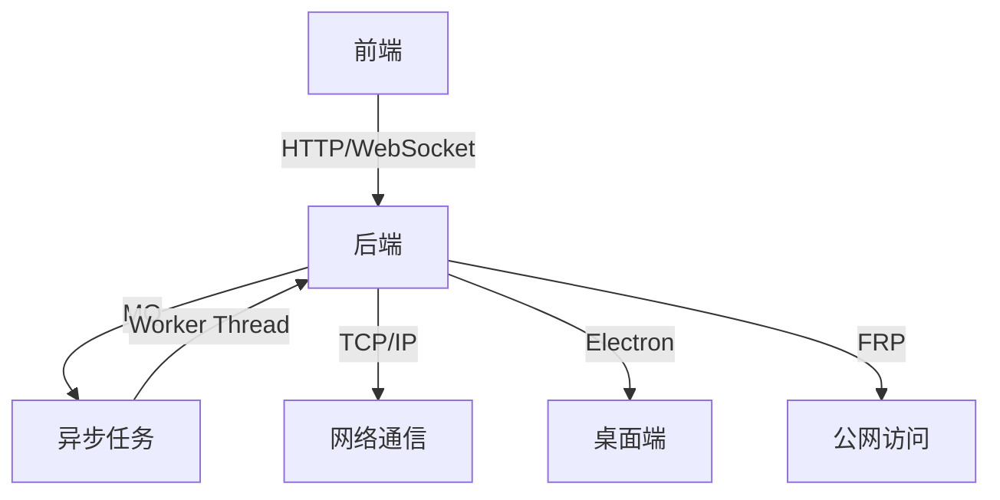

## 账号信息
- 手机号: `13322603515` 密码: `123456`
- 邮箱: `2105837635@qq.com` 密码: `jianyaokeji@200324` 备注: `123456这个账号登录插件`
https://www.tt123.com/
## bital代码库
- https://git.bitaihub.com/
- lrh@bitaihub.com
- 20040502lrh
## MQ 地址
- URL: `http://112.74.104.156:15672`
- 用户名: `admin`
- 密码: `e897e069`

## 数据库连接
- 地址: `rm-wz9hpx2gt8nnnz10qco.mysql.rds.aliyuncs.com`
- 账号: `daren_dev_user`
- 密码: `@daren123`

## 技术栈

### 1. 运维/管理
- **容器化**：`Docker`
- **操作系统**：`Linux`
- **版本控制**：`Git`

### 2. 前端
- **基础技术**：`HTML/CSS/JS`（三件套）
- **框架**：`Vue` + `WXT`（浏览器扩展开发）
- **构建工具**：`Vite`（替代 Webpack）
- **状态管理**：`Pinia`（替代 Vuex）

### 3. 后端开发
- **运行时**：`Node.js Express`
- **语言**：`TypeScript`
- **前后端协作**：`WebSocket（基于 Socket.io 库）/get/post`

### 4. 网络通信/实时通信
- **消息队列**：`QM`（如 RabbitMQ/Kafka）
- **实时协议**：`WebSocket`（基于 `Socket.io` 库）
- **底层协议**：`TCP/IP`

### 5. 设计模式
- **架构模式**：`MVC`（Model-View-Controller）

### 6. 线程设计模式
- **并发模型**：
  - `Worker Thread`（工作线程）
  - 线程池与主从模式

### 7. 客户端框架
- **跨平台桌面应用**：`Electron`

### 8. 数据库
- **关系型数据库**：`MySQL`
  - 设计特点：单表高效查询（非分表设计）

### 9. 服务器工具
- **内网穿透**：`FRP`（Fast Reverse Proxy）

### 10. 自动化测试工具
- **端到端测试**：`Playwright`（支持多浏览器）
### 11.al
-`火山引擎+deepseek`

### 技术栈关联图

## 测试命令
```bash
npx ts-node src/index.ts
```

## Git 相关

- 仓库地址: [Bitai/creator-unified-exp](https://git.bitaihub.com/Bitai/creator-unified-exp)
```bash
克隆分组
$ git clone https://e.coding.net/g-sldf2848/agenthub/creator-extension.git 
cd到抓下来的目录
$ cd creator-extension/
切换到指定分支和标签
$ git checkout  feature/sendmsg
显示所有指定分支
$ git branch
查看目录文件
$ ls
显示所有指定分支
$ git branch feature/login-feature
切换到指定分支和标签
$ git checkout feature/login-feature
查看目录文件
$ ls
执行合并
git merge origin/feature/login_feature_1.0.2  # 如果分支在远程

命令来切换到某个提交哈希
git checkout 0d5e215f7c5fd41453f7b4661df35a4a91e2ca8a

content:负责监听
--api
background:后端

是不追踪文件可以避免提交是吗
git update-index --skip-worktree packages/creator-extension/config/env.ts
  ```
## 测试代码
```javascript
async function findTikTokTab() {
  const tabs = await chrome.tabs.query({ 
    url: "https://affiliate-us.tiktok.com/product/sample-request?shop_region=US",
    status: "complete"
  });
  if (!tabs.length) throw new Error("未找到TikTok Affiliate标签页，请先打开对应页面");
  return tabs[0].id;
}

// ===== 测试消息数组 =====
const testMessages = [
  // 测试消息1：content_type = 1（视频内容）
  {
    type: "get_video_data_response",
    data: {
      video_id: "8070728021973831829",
      region: "US",
      options: {
        size: 20,
        offset: 0,
        content_type: 1,  // 视频内容
        user_language: "en"
      }
    },
    taskId: "test-task-video",
    messageId: "test-msg-video"
  },
  // 测试消息2：content_type = 2（直播内容）
  {
    type: "get_video_data_response",
    data: {
      video_id: "8070728021973831829",
      region: "US",
      options: {
        size: 20,
        offset: 0,
        content_type: 2,  // 直播内容
        user_language: "en"
      }
    },
    taskId: "test-task-live",
    messageId: "test-msg-live"
  },
  // 测试消息3
  {
    type: "get_video_data_response",
    data: {
      video_id: "8070726829523898551",
      region: "US",
      options: {
        size: 20,
        offset: 0,
        content_type: 2,  // 直播内容
        user_language: "en"
      }
    },
    taskId: "test-task-live",
    messageId: "test-msg-live"
  }
];

// ===== 执行测试 =====
(async () => {
  try {
    const tabId = await findTikTokTab();
    console.log("🔍 目标标签页ID:", tabId);
    let i = 1;
    // 遍历测试消息数组
    for (const testMessage of testMessages) {
      console.log(`\n=== 测试 content_type=${testMessage.data.options.content_type}  测试点${i}===`);
      i++;
      console.log("📤 发送测试消息:", testMessage);
      
      const response = await chrome.tabs.sendMessage(tabId, testMessage);
      console.log("📥 收到响应:", response);

      // 模拟socketService处理
      const socketResponse = {
        type: "GET_VIDEO_DATA_RESPONSE",
        message: `测试成功 (content_type=${testMessage.data.options.content_type})`,
        token: "mock-token",
        shopId: "mock-shop-id",
        data: response,
        code: 0,
        taskId: testMessage.taskId
      };
      console.log("🚀 模拟socket响应:", socketResponse);
    }
    console.log("All_AC");
  } catch (error) {
    console.error("❌ 测试失败:", error);
  }
})();
```

## 测试结果
- 分支 `origin/maoqi/feature/task_schedule` 完美通过。
- 可以正常向插件以指定频率发送请求。
- 可以正确返回请求结果，并且 `data` 和 `token` 皆为正常。
- `0ms` 成功触发保底机制。

## 数据库

### `ba_creator`
- 所有达人

### `ba_creator_message`
- 发送消息列表（从 `id` 大的开始，然后一个一个发，发过的设定 `is_send=1`）

### `ba_dict`
- 达人货物和任务状态字典

### `ba_operation_log`
- 全部事件 debug 储存点

### `ba_shop_creator`
- （无描述）

### `ba_system_setting`
- 商品种类标签

### `ba_tag`
- 任务标签

### `ba_task_new`
- 客户端的任务：
  - `id` 是对应的客户端任务。
  - `name` 是其名字。
  - 各种 `template` 对应其不同状态发送的消息。

### `ba_task_creator`
- 客户端的任务达人：
  - `task_id` 是对应的客户端任务。

### `ba_user_shop`
- BitAI 用户数据：
  - `user_id` 代表对应用户拥有的抖音店铺（例如：如果看到两个 `96`，就是 96 号的用户有 2 家抖音店）。
  - `ai_chat` 是是否禁用 AI 聊天。

##货物信息测试数据
```javascript
        const datas = [

    {
      "apply_id": "8070726829523898551",
      "product_title": "DR.HARRY Little green tube Joint Gel Green Joint Cream",
      "product_id": "1731176889072914712",
      "sku_id": "1731176938878832920",
      "sku_desc": "1 PCS",
      "sku_image": "https://p19-oec-ttp.tiktokcdn-us.com/tos-useast5-i-omjb5zjo8w-tx/37a4b615d8614645b4b3f740f41209e9~tplv-omjb5zjo8w-origin-jpeg.jpeg?dr=10493&t=555f072d&ps=933b5bde&shp=e326b0ff&shcp=56b29210&idc=useast5&from=3810963711",
      "commission_rate": "1000",
      "sku_left_num": Math.floor(Math.random() * 10),
      "curr_status": Math.random() > 0.5 ? 40 : 30,
      "expired_in": 0,
      "fulfillment_status": 0,
      "main_order_id": "577005471617814711",
      "source_type": 2,
      "is_appealed": false,
      "no_limit_quantity": false,
      "sample_order_type": 10,
      "create_time": Date.now() - 86400000,
      "fulfillment_expire_time": Date.now() + 86400000 * 3,
      "review_status": Math.random() > 0.5 ? 10 : 11,
      "is_review_expire": false,
      "review_expire_time": Date.now() + 86400000 * 7,
      "is_algo_recommend": true,
      "standard_commission": {
          "commission_type": 1,
          "fixed_commission_rate": 1000
      },
      "creator_id": "7494000153775672011"
  },
  {
    "apply_id": "8070726829523898552",
    "product_title": "DR.HARRY Little green tube Joint Gel Green Joint Cream",
    "product_id": "1731176889072914712",
    "sku_id": "1731176938878832920",
    "sku_desc": "1 PCS",
    "sku_image": "https://p19-oec-ttp.tiktokcdn-us.com/tos-useast5-i-omjb5zjo8w-tx/37a4b615d8614645b4b3f740f41209e9~tplv-omjb5zjo8w-origin-jpeg.jpeg?dr=10493&t=555f072d&ps=933b5bde&shp=e326b0ff&shcp=56b29210&idc=useast5&from=3810963711",
    "commission_rate": "1000",
    "sku_left_num": Math.floor(Math.random() * 10),
    "curr_status": Math.random() > 0.5 ? 40 : 30,
    "expired_in": 0,
    "fulfillment_status": 0,
    "main_order_id": "577005471617814711",
    "source_type": 2,
    "is_appealed": false,
    "no_limit_quantity": false,
    "sample_order_type": 10,
    "create_time": Date.now() - 86400000,
    "fulfillment_expire_time": Date.now() + 86400000 * 3,
    "review_status": Math.random() > 0.5 ? 10 : 11,
    "is_review_expire": false,
    "review_expire_time": Date.now() + 86400000 * 7,
    "is_algo_recommend": true,
    "standard_commission": {
        "commission_type": 1,
        "fixed_commission_rate": 1000
    },
    "creator_id": "7495682353119791401"
},
      {
        "apply_id": "8070726829523898553",
        "product_title": "DR.HARRY Little green tube Joint Gel Green Joint Cream",
        "product_id": "1731176889072914712",
        "sku_id": "1731176938878832920",
        "sku_desc": "1 PCS",
        "sku_image": "https://p19-oec-ttp.tiktokcdn-us.com/tos-useast5-i-omjb5zjo8w-tx/37a4b615d8614645b4b3f740f41209e9~tplv-omjb5zjo8w-origin-jpeg.jpeg?dr=10493&t=555f072d&ps=933b5bde&shp=e326b0ff&shcp=56b29210&idc=useast5&from=3810963711",
        "commission_rate": "1000",
        "sku_left_num": Math.floor(Math.random() * 10),
        "curr_status": Math.random() > 0.5 ? 40 : 30,
        "expired_in": 0,
        "fulfillment_status": 0,
        "main_order_id": "577005471617814711",
        "source_type": 2,
        "is_appealed": false,
        "no_limit_quantity": false,
        "sample_order_type": 10,
        "create_time": Date.now() - 86400000,
        "fulfillment_expire_time": Date.now() + 86400000 * 3,
        "review_status": Math.random() > 0.5 ? 10 : 11,
        "is_review_expire": false,
        "review_expire_time": Date.now() + 86400000 * 7,
        "is_algo_recommend": true,
        "standard_commission": {
            "commission_type": 1,
            "fixed_commission_rate": 1000
        },
        "creator_id": "7496008487054969053"
    }
    
  ]
      // 发送消息
      this.sendMessage({
        type: 'getApplySamplesRes',
        message: '获取样品申请列表成功',
        token: result.userToken,//"13917a3b-e804-47c8-bab1-18ab92adfbeb"
        shopId: result.shopId,//"7496137447838681368"
        data:datas,//datas
        code: 0,
      });
      ```